# Spec: 金流重構-充值 後台部分

- 需求單：Notion ID 4644 / `[需求 會員端]金流重構-充值`
- Notion：`https://app.notion.com/p/wowgaming/325fc5d788a980b9bdd2d50e89c612dd#328fc5d788a980a1b4f0d3c4135f1286`
- Jira：`P16T-104`、`NS-270`；關聯：`NS-65`、`[需求 會員端]金流重構 - 提現`、`[需求 代理端]新增會員Group跟tag功能`
- 端別：代理端 = `Whitelabel_GSI_Dashboard`（本 repo）
- 主要範圍：後台金流管理能力，支援會員端充值/提現重構所需的金流群組、分類、排序、限額、餘額與權限設定。
- 現有相關頁：`/CashFlow/List/`、`/CashFlow/PaymentTypeManagement/`、`/CashFlow/CashFlowMerchantManagement/`

## 背景 / 目標

會員端充值重構的核心目標是：玩家只需要選擇自己理解的支付方式與金額，例如法幣/虛擬幣、銀行、電子錢包、QRIS、DANA，不需要知道背後是哪一家三方金流或哪個 gateway。

後台因此需要新增一層「金流群組/類別」設定，把多個實際支付渠道歸類成會員端可理解的支付類型，並讓既有金流管理可以設定分類、每日限額、剩餘額度、商戶可用餘額與派發權重。

本 spec 只規劃代理端後台。會員端充值畫面與派發流程圖在本文件中作為資料用途與驗收背景，不直接要求在本 repo 實作會員端 UI。

## 名詞與文案原則

需求單不同位置使用不同名稱，前端不可自行統一。

| 使用位置 | 文案 |
|---|---|
| 選單 / 功能路徑 | 金流群組管理 |
| 權限設定 | 金流類別管理 |
| 金流管理列表欄位 | 金流類別 |
| 金流管理編輯欄位 | 分類 |

如需新增 user-visible copy，但需求單沒有提供遠端 i18n key，依 repo 規則可先 hardcode 或回來確認，不自行發明 i18n key。

## 頁面功能拆分

本 spec 以「頁面 / 功能」作為第一層拆分，讓實作時可以直接切 task。共通權限、移除舊頁與 API 契約放在頁面規格後面。

### 1. 金流群組管理頁

功能路徑：後台 - 財務管理 - 新增 `金流群組管理`。

實作目的：讓商戶建立會員端可見的金流群組/類別，後續金流管理的「分類」下拉也從此頁資料取得。

路由建議：

| 項目 | 規格 |
|---|---|
| Route | `/CashFlow/PaymentGroupManagement/` 或實作時依現有命名慣例決定 |
| Page | 建議新增 `src/pages/CashFlow/PaymentGroupManagement/Index.vue` 或等價頁面 |
| 選單文案 | `金流群組管理` |
| `menuShow` | 跟目前 `/CashFlow/List/` 一樣：`["admin", "generalAgent", "agent", "anibetAgent"]` |
| 權限 | 使用新「金流類別管理」權限，不沿用既有金流管理權限 |

查詢條件：

| 欄位 | 格式 | 說明 | API 對應 |
|---|---|---|---|
| 幣別 | 下拉選單 | 站點設定的幣別分類，前台充/提顯示用；預設空值；選項：法幣、虛擬貨幣 | `currency_type`：1 法幣、2 虛擬幣 |
| 服務 | 下拉選單 | 用於存款/取款；預設空值；選項：存款、取款 | `payment_method`：1 存款、2 出款 |

列表欄位：

| 欄位 | 格式 | 說明 | API 對應 |
|---|---|---|---|
| 名稱 | 文字 | 商戶設定的金流類型名稱，此名稱會成為金流管理「分類」下拉選項 | `name` |
| 支援幣別 | 文字 | 金流群組支援的法幣錢包，例如 THB、MYR | `currency` 轉幣別代碼 |
| 幣別 | 文字 | 法幣或虛擬幣 | `currency_type` |
| 支付類型 | 文字 | 銀行、電子錢包、虛擬幣錢包；電子錢包需顯示階層，例如 `電子錢包-LINE` | 待確認，目前 Apifox 無 provider 欄位 |
| 服務 | 文字 | 存款或取款 | `payment_method` |
| 排序 | 文字 | 會員端金流排序 | `sort_priority` |
| Icon | 圖片 | 商戶設定的金流類型 icon | `icon_path` |
| 功能 | Button | 編輯、刪除 | 依 edit 權限顯示 |

行為：

- Search 後排序規則：法幣在前，虛擬幣在後。
- 點新增：進入金流群組新增頁。
- 點編輯：進入該筆資料的金流群組編輯頁並帶入資料。
- 點刪除：彈出確認視窗，確認後刪除該筆資料。
- 無編輯權限時，不顯示新增、編輯、刪除等會改資料的操作。

API：

- `GET /v1/agent/payment/group/list`。
- Apifox 目前只看到 Authorization header，未看到 query params；分頁與篩選參數需後端補文件或確認。

目前缺口 / 待確認：

- List API 未標示 `offset / size / currency_type / payment_method / currency` 等查詢參數。
- Apifox group response 沒有「支付類型」欄位，也沒有電子錢包 provider 欄位；列表要顯示 `銀行 / 電子錢包-LINE / 虛擬幣錢包` 目前資料不足。
- `currency` 回的是幣種 ID，需確認前端沿用哪個既有幣別列表轉成 THB/MYR 顯示。
- 刪除群組若已被金流渠道使用，後端規則未定。

### 2. 金流群組新增 / 編輯頁

功能路徑：後台 - 財務管理 - `金流群組管理` - 新增 / 編輯。

表單欄位：

| 欄位 | 格式 | 說明 | API 對應 |
|---|---|---|---|
| 名稱 | 文字輸入框 | 商戶設定的金流類型名稱；儲存時需檢查名稱是否重複 | `name` |
| 支援幣別 | 下拉選單 | 此站點支援的幣別，例如 THB、MYR；單一法幣錢包時直接預設 | `currency` |
| 幣別 | 下拉選單 | 法幣、虛擬幣 | `currency_type` |
| 支付類型 | 下拉選單 | 銀行、電子錢包、虛擬幣錢包 | 待確認，目前 Apifox 無獨立欄位 |
| 電子錢包供應商 | 下拉選單 | 僅支付類型選電子錢包時顯示；選項為目前所有電子錢包供應商名稱；排序 DESC | 待確認 provider API / 欄位 |
| 服務 | 下拉選單 | 存款、取款 | `payment_method` |
| 排序 | 文字輸入框 | 會員端金流排序 | `sort_priority` |
| Icon | upload | 檔案尺寸 40*16px；大小 1MB 以內；格式 jpeg、jpg、png、webp | `icon_path` |

按鈕與行為：

- 確認：保存資料；若名稱重複，顯示 `新增失敗：當前名稱已存在於系統中，請修改後再提交`。
- 取消：不保存，返回金流群組管理列表。
- 編輯頁載入時用詳情 API 帶入既有資料。
- `PUT` 文件標示為部分更新，但前端可依既有表單習慣送完整表單；需與後端確認是否接受完整 body。

API：

| 行為 | API |
|---|---|
| 新增 | `POST /v1/agent/payment/group` |
| 詳情 | `GET /v1/agent/payment/group/:id` |
| 編輯 | `PUT /v1/agent/payment/group/:id` |
| 刪除 | `DELETE /v1/agent/payment/group/:id` |
| Icon 上傳 | 待確認是否共用既有 `payment/upload/image` |

目前缺口 / 待確認：

- Icon 上傳 API 未確認；Apifox CRUD 收 `icon_path`，但既有上傳 API 回傳型態可能是 image id。
- 需求要「支付類型」與「電子錢包供應商」，但 Apifox CRUD body 沒有對應欄位。
- 名稱重複時的錯誤 code / response message 未確認；目前只有需求指定前端顯示文案。
- `PUT` 是部分更新；前端送完整表單是否 OK 需確認。

### 3. 金流管理列表頁擴充

功能路徑：後台 - 財務管理 - `金流管理`。

實作目的：在既有支付渠道列表中顯示分類、限額、剩餘額度、三方餘額與派發排序，讓商戶可以控管會員端實際可用渠道。

新增列表欄位：

| 欄位 | 格式 | 說明 | API 需求 |
|---|---|---|---|
| 當日存/取款上限 | 文字 | 商戶設定的當日存/取款上限；無上限顯示 `-` | `daily_limit` |
| 當日剩餘額度 | 文字 | 當日上限扣除已使用額度後的剩餘額度 | `daily_remaining_limit` |
| 當前可用餘額 | 文字 | 三方代收/代付可用餘額；三方不提供 API 時顯示 `-` | `current_available_balance` |
| 排序/權重 | 文字 | 三方存/取款優先使用度，數字越大越先使用、越靠前 | `sort_priority` 或 `weight` |
| 金流類別 | 文字 | 該支付渠道所屬金流類別 | `payment_group_name` |

操作：

- Search 排序：服務、排序/權重；排序/權重大到小。
- 重新整理：商戶可手動刷新當前可用餘額。
- 重置按鈕：點擊後，當日剩餘額度重置回初始上限。

額度計算規則：

- 當該渠道關閉後再開啟，額度重置並恢復上限。
- 每日 `00:00:00` 額度重置並恢復上限。
- 系統自動關閉後，需要商戶/站長自行手動開啟。
- 變更上限時，剩餘額度直接以新上限重置，不累加。
  - 例：原剩 9,000，上限改為 20,000 後，剩餘額度直接重置為 20,000。

API：

- 既有 `GET payment/gateway/list` 需擴充欄位。
- 餘額刷新 API 仍缺。
- 當日剩餘額度重置 API 仍缺。

目前缺口 / 待確認：

- `payment/gateway/list` 尚未確認會回 `daily_limit / daily_remaining_limit / current_available_balance / payment_group_id / payment_group_name / sort_priority`。
- 重新整理餘額 API 未提供。
- 重置當日剩餘額度 API 未提供。
- 無上限、三方不提供餘額時，後端回 `null / 0 / - / 空字串` 未確認；前端顯示統一是 `-`。
- Search 排序「服務 + 權重大到小」由後端排序還是前端排序未確認。

### 4. 金流管理編輯頁擴充

功能路徑：後台 - 財務管理 - `金流管理` - 編輯。

新增欄位：

| 欄位 | 格式 | 說明 | API 需求 |
|---|---|---|---|
| 分類 | 下拉選單 | 選項取自金流群組管理的「名稱」資料 | `payment_group_id` |
| 當日存/取款上限 | 文字輸入框 | 商戶設定三方存/取款上限；到達上限時後端需自動關閉該通道 | `daily_limit` |
| 排序(權重) | 文字輸入框 | 數字越大越先使用；不檢查重複，重複時以新創立的優先使用 | `sort_priority` 或 `weight` |

分類下拉規則：

- 選項來源：金流群組管理資料。
- 選項需依支援幣種變動。
  - 例：只設定 TWD + LINE 群組時，編輯 THB 渠道不應出現 LINE 分類。
- 金流管理中的支付類型分類需與金流群組管理設定的支付類型保持一致。
- 當沒有分類時，該渠道不能顯示或派發給會員使用。
- 站點過去未分類的三方可先分類在「第三方支付」分類；更新前需由 AM 通知站點/商戶，避免客訴。

提示文案：

```text
金流管理中的支付類型分類，需與金流群組管理所設定的支付類型保持一致。 若金流管理設定為「銀行」類型，卻被分類至「電子錢包」支付群組，可能導致玩家充值或提款失敗。請於設定時務必確認支付類型是否正確對應。
```

英文文案：

```text
The payment type category configured in Payment Management must match the payment type set in Payment Group Management.

For example, if a payment channel is configured as a “Bank” type but is assigned to an “E-Wallet” payment group, it may cause deposit or withdrawal failures for players.

Please ensure the payment type is correctly matched before saving the settings.
```

欄位驗證：

- 當日存/取款上限：字元 12；正整數；空值默認無上限。
- 排序(權重)：字元 3；正整數；不允許空值；數字越大越先使用。
- 確認儲存：不檢查排序重複；重複時以新創立的為先。
- 銀行轉帳、第三方支付、虛擬貨幣轉帳、虛擬貨幣支付四大類別都使用當日存/取款上限設定。

API：

- 既有 `GET payment/gateway/:id` 需回傳新增欄位。
- 既有 `PUT payment/gateway/:id/edit` 需支援送出新增欄位。
- 分類下拉可使用 `GET /v1/agent/payment/group/list`；若後端提供精簡 options API，可再改用 options API。

目前缺口 / 待確認：

- `payment/gateway/:id` 尚未確認會回 `payment_group_id / daily_limit / sort_priority`。
- `payment/gateway/:id/edit` 尚未確認可寫入 `payment_group_id / daily_limit / sort_priority`。
- 分類下拉要依支援幣種、服務、支付類型過濾；目前 group API 只有 `currency / payment_method`，缺支付類型/provider 欄位。
- 「無分類渠道不能顯示或派發」由後端阻擋、會員端過濾，或後台禁止啟用，規則未確認。
- 權重重複時「新創立的優先使用」需後端排序規則支援，目前未看到 `created_at` 或排序 tie-breaker 欄位。

### 5. 權限與選單

本需求新增的頁面權限名稱與畫面名稱不同，需照需求單分別使用：

| 位置 | 文案 |
|---|---|
| 選單 / 功能路徑 | 金流群組管理 |
| 權限設定 | 金流類別管理 |

規格：

- 「金流群組管理」掛在後台金流/財務管理底下。
- 新功能 `menuShow` 全線跟目前金流管理 `/CashFlow/List/` 一樣：`["admin", "generalAgent", "agent", "anibetAgent"]`。
- 新功能使用獨立「金流類別管理」權限，不沿用既有「金流管理」。
- 權限設定頁要在「金流管理」底下新增「金流類別管理」權限，包含查看、編輯，皆預設開啟。

目前前端既有權限：

- `A_F_PAYMENT_TYPE_SETTING = 3330500` 支付類型管理：本次需移除。
- `A_F_CASH_FLOW = 3330100` 金流管理：不可沿用。
- `A_F_GATEWAY_CONNECTION = 3330300` 金流商戶管理：不可沿用。

需後端提供新權限 code：

| 權限 | 說明 |
|---|---|
| Function：金流類別管理 | route/menu 使用 |
| Action：金流類別管理_VIEW | 查看 |
| Action：金流類別管理_EDIT | 編輯 |

目前缺口 / 待確認：

- 新「金流類別管理」permission enum id/code 未提供。
- 權限預設開啟是後端權限樹預設，還是前端只顯示已回傳權限，需確認。
- 選單文案 `金流群組管理` 與權限文案 `金流類別管理` 是否已有遠端 i18n key 未確認；沒有 key 時依 repo 規則先 hardcode 或再確認。

### 6. 移除支付類型管理

需求明確：`支付類型管理頁面因與金流群組管理功能重複，故要移除`。

前端需移除：

- `/CashFlow/PaymentTypeManagement/` route/menu。
- `pages/CashFlow/PaymentTypeManagement.vue` 若沒有其他引用，可刪除。
- `A_F_PAYMENT_TYPE_SETTING / A_A_PAYMENT_TYPE_SETTING_VIEW / A_A_PAYMENT_TYPE_SETTING_EDIT` 使用點。
- 與支付類型管理頁專用 API wrapper / hook 使用點若無其他引用，也需移除。

需後端確認：

- 舊 `getAvailableTypeSettings()`、`putAvailableTypeSettings()` 或對應 API 是否仍保留給舊端使用。
- 後台權限樹是否也會移除「支付類型管理」。

目前缺口 / 待確認：

- 若後端仍回傳支付類型管理權限，前端是否只移除 route/menu 即可，或需同步移除權限 mapping。
- `pages/CashFlow/PaymentTypeManagement.vue` 是否還有測試/文件引用需實作時以 `rg` 確認。
- 舊 API wrapper 若仍被其他頁使用，不能刪；只移除本頁入口與未使用程式碼。

### 7. API / 資料契約 / 權限缺口

Apifox project：`https://app.apifox.com/project/4860774`，檢視日期：2026-06-26。

本需求分成兩類 API：

- 代理端後台本 repo 需要直接接的 API：`/v1/agent/payment/group*` 與既有 `payment/gateway*` 擴充。
- 會員端跨端契約：`/v1/player/payment_gateway/groups`、`/v1/player/payout_settings*`、`deposit/withdraw + group_id`，本 repo 不直接實作 UI，但需在 spec 中保留，避免後台欄位與會員端資料契約斷開。

#### 7.1 已確認：金流群組管理 CRUD

後台新增 API：

| 用途 | Method / Path | 後台使用情境 |
|---|---|---|
| 新增群組 | `POST /v1/agent/payment/group` | 金流群組新增表單送出 |
| 查詢列表 | `GET /v1/agent/payment/group/list` | 金流群組管理列表、金流管理分類下拉資料來源 |
| 取得詳情 | `GET /v1/agent/payment/group/:id` | 金流群組編輯頁帶入資料 |
| 更新群組 | `PUT /v1/agent/payment/group/:id` | 金流群組編輯表單送出 |
| 刪除群組 | `DELETE /v1/agent/payment/group/:id` | 金流群組列表刪除 |

通用規則：

- 都需要 `Authorization: Bearer <token>`。
- 前端 wrapper 建議新增在 `src/api/paymentGateway.ts`，type 新增在 `src/api/request.type.ts`、`src/api/response.type.ts`。
- 本 repo request path 應沿用既有寫法，不寫 `/v1` 前綴，例如 `agent/payment/group/list`。

`PaymentGatewayGroup` 欄位：

| 欄位 | 型別 | Apifox 說明 / 前端用途 |
|---|---|---|
| `id` | number | 群組 ID |
| `agent_id` | number | 代理 ID；列表/詳情 response 有 |
| `currency_type` | `1 | 2` | 1 法幣、2 虛擬幣 |
| `name` | string | 群組名稱；畫面「名稱」，也是金流管理「分類」下拉文字 |
| `currency` | number | 幣種 ID，對應 currency 表；畫面需轉成幣別代碼顯示 |
| `payment_method` | `1 | 2` | 1 存款、2 出款；畫面「服務」 |
| `sort_priority` | number | 排序權重 |
| `icon_path` | string \| null | Icon 路徑 |

`GET /v1/agent/payment/group/list`

- Apifox 目前只列 Authorization header，沒有列出 query params。
- Response：`BaseResponse<{ list: PaymentGatewayGroup[]; pagination: { offset: number; size: number; total: number } }>`。
- Example item：`id / agent_id / currency_type / name / currency / payment_method / sort_priority / icon_path`。

`POST /v1/agent/payment/group` body：

| 欄位 | 必填 | 說明 |
|---|---|---|
| `currency_type` | Y | 1 法幣、2 虛擬幣 |
| `name` | Y | 群組名稱 |
| `currency` | Y | 幣種 ID |
| `payment_method` | Y | 1 存款、2 出款 |
| `sort_priority` | N | 預設 0 |
| `icon_path` | N | string 或 null |

Response：`{ code: 0, msg: "success" }`。

`GET /v1/agent/payment/group/:id`

- Path：`id` number，金流群組 ID。
- Response：`BaseResponse<PaymentGatewayGroup>`。

`PUT /v1/agent/payment/group/:id`

- Path：`id` number，金流群組 ID。
- Body：部分更新，`currency_type / name / currency / payment_method / sort_priority / icon_path` 皆選填。
- Response：`{ code: 0, msg: "success" }`。

`DELETE /v1/agent/payment/group/:id`

- Path：`id` number，金流群組 ID。
- Response：Apifox 為 generic `BaseResponse<unknown>`，example `{ code: 0, msg: "string", data: "string" }`。

#### 7.2 已確認：會員端取得出/入款群組

`GET /v1/player/payment_gateway/groups`

- 本 repo 不直接接會員端 API，但後台群組、排序、icon、渠道分類會影響此 response。
- Apifox 狀態：已發布。
- Request：`payment_method` 必填，`1` 存款、`2` 出款。
- 注意：Apifox 把它放在 `Body 参数 application/json`，curl 也是 GET + `--data-raw`；但文件標題寫「查詢參數」。需後端確認正式用法是 query 還是 GET body。

Response：`BaseResponse<PlayerPaymentGatewayGroup[]>`。

`PlayerPaymentGatewayGroup`：

| 欄位 | 型別 | 說明 |
|---|---|---|
| `id` | number | 群組 ID |
| `name` | string | 群組名稱 |
| `currency` | number | 幣種 ID |
| `currency_type` | `1 | 2` | 1 法幣、2 虛擬幣 |
| `sort_priority` | number | 群組排序權重 |
| `icon_path` | string \| null | icon 路徑 |
| `agent_payment_gateways` | array | 群組內可用金流渠道列表 |

`agent_payment_gateways` example 欄位：

| 欄位 | 型別 | 說明 |
|---|---|---|
| `id` | number | 渠道 ID |
| `name` | string | 渠道名稱 |
| `available_amount` | string | 可用額度；example `-1`、`500` |
| `third_party_balance` | string | 三方餘額；example `0`、`10000` |
| `sort_priority` | number | 渠道排序權重 |
| `max_amount` | string | 單筆最大金額 |
| `min_amount` | string | 單筆最小金額 |
| `audit_rate` | string | 稽核倍數 |
| `fee_type` | number | 手續費類型 |
| `fee_amount` | string | 固定手續費 |
| `fee_rate` | string | 比例手續費 |
| `usdt_rate` | string | USDT 匯率 |

#### 7.3 已確認：會員端提款設定

以下 API 屬會員端「出款設置(NEW)」，本 repo 不直接新增頁面，但與出款群組 / withdraw `group_id` 的資料流有關。

| 用途 | Method / Path | 契約摘要 |
|---|---|---|
| 列表 | `GET /v1/player/payout_settings` | query `method_type?: 1 | 2 | 3`；response `data.list` |
| 建立 | `POST /v1/player/payout_settings` | body 必填 `payout_method_id / name / method_type / payload`，`ewallet_provider_id` 選填 |
| 詳情 | `GET /v1/player/payout_settings/:id` | path `id >= 1`；response 單筆設定 |
| 更新 | `PUT /v1/player/payout_settings/:id` | 部分更新 `name / ewallet_provider_id / payload` |
| 刪除 | `DELETE /v1/player/payout_settings/:id` | response `{ code: 0, msg: "success" }` |

`method_type`：`1` 銀行卡、`2` 電子錢包、`3` 加密貨幣錢包。

提款設定欄位：

| 欄位 | 型別 | 說明 |
|---|---|---|
| `id` | number | 設定 ID |
| `member_id` | number | 會員 ID |
| `payout_method_id` | number | 對應 `payout_methods.id` |
| `name` | string | 設定名稱 |
| `method_type` | `1 | 2 | 3` | 設定類型 |
| `ewallet_provider_id` | number | 電子錢包 provider；非電子錢包可傳 0 |
| `payload` | object | 依 `method_type` 決定結構 |
| `created_at` | string | 建立時間 |
| `updated_at` | string | 更新時間 |

#### 7.4 需求指定調整，但 Apifox 尚未反映：deposit / withdraw + `group_id`

使用者提供需求：

- `POST /v1/player/deposit` 新增 `group_id`。
- `POST /v1/player/withdraw` 新增 `group_id`。

Apifox 現況：

- `POST /v1/player/deposit` 文件 body 目前沒有 `group_id`；修改時間顯示 3 個月前。
- `POST /v1/player/withdraw` 文件 body 目前沒有 `group_id`；修改時間顯示 1 年前。

因此 spec 先以需求為準，要求後端補文件與契約：

`POST /v1/player/deposit` 既有 body：

| 欄位 | 目前狀態 |
|---|---|
| `amount` | 必填 string |
| `currency` | 必填 string，幣別代碼 |
| `payment_gateway_id` | 必填 number，付款通道 ID |
| `papaya_pay` | 必填 object，由取得入款支付設定提供 |
| `images` | 文件列為必填 array[string]，example 未帶 |
| `group_id` | 需求新增；Apifox 未列，需補 |

`POST /v1/player/withdraw` 既有 body：

| 欄位 | 目前狀態 |
|---|---|
| `amount` | 必填 string |
| `payment_gateway_id` | 必填 number，付款通道 ID |
| `payment_type_id` | 必填 number，支付類型 ID |
| `currency` | 必填 string，幣別代碼 |
| `bank_id` | 必填 number，銀行卡編號 |
| `withdrawal_password` | 必填 string |
| `images` | 文件列為必填 array[string]，example 未帶 |
| `group_id` | 需求新增；Apifox 未列，需補 |

需後端/會員端確認：

- 加上 `group_id` 後，`payment_gateway_id` 是否仍必填。
- 若玩家只選群組不選實際 gateway，實際渠道派發由前端送 `payment_gateway_id` 還是後端依 `group_id + amount + currency + weight + remaining limit` 決定。
- `group_id` 不合法、群組內無可用渠道、渠道額度已滿時，錯誤碼與文案如何回傳。

#### 7.5 Blocking：既有金流管理 API 擴充仍缺

使用者提供的新 API 只涵蓋「金流群組」與會員端契約；後台既有「金流管理」列表/編輯新增欄位，仍需要後端擴充既有 dashboard API。

本 repo 現有 wrapper：`src/api/paymentGateway.ts`。

| 現有 API | 需新增 / 確認欄位 |
|---|---|
| `GET payment/gateway/list` | `daily_limit`、`daily_remaining_limit`、`current_available_balance`、`sort_priority` 或 `weight`、`payment_group_id`、`payment_group_name` |
| `GET payment/gateway/:id` | 編輯頁需回 `payment_group_id`、`daily_limit`、`sort_priority`/`weight` |
| `PUT payment/gateway/:id/edit` | 編輯頁需可送 `payment_group_id`、`daily_limit`、`sort_priority`/`weight` |

需確認：

- 無上限用 `null`、`0`、空字串或 `-`；前端顯示需求是 `-`。
- 三方不提供餘額 API 時後端回 `null` 還是 `-`；前端顯示需求是 `-`。
- 改 `daily_limit` 時，後端是否直接把 `daily_remaining_limit` 重置為新上限。
- 無分類渠道是否由後端阻擋啟用/派發，或只在會員端不顯示。

#### 7.6 Blocking：餘額刷新 / 當日額度重置 API 仍缺

需求需要既有金流管理列表提供：

| 操作 | 需求 | API 狀態 |
|---|---|---|
| 重新整理當前可用餘額 | 商戶可手動刷新單一渠道三方餘額 | 使用者提供 API 清單未包含，Apifox 本輪未看到對應新 API |
| 重置當日剩餘額度 | 點擊後重置回初始上限 | 使用者提供 API 清單未包含，Apifox 本輪未看到對應新 API |

需後端新增或指定既有 API。建議契約：

| 用途 | 建議 API | 回傳 |
|---|---|---|
| 刷新單一渠道餘額 | `POST /v1/agent/payment/gateway/:id/balance/refresh` 或後端指定路徑 | 更新後 `current_available_balance` |
| 重置單一渠道剩餘額度 | `POST /v1/agent/payment/gateway/:id/daily-limit/reset` 或後端指定路徑 | 更新後 `daily_remaining_limit` |

#### 7.7 Blocking：金流群組列表篩選 / 分頁契約仍缺

需求畫面需要：幣別類型、服務篩選，以及 pagination。Apifox list response 有 pagination，但 request 只看到 Authorization，沒有 query params。

需後端補充 `GET /v1/agent/payment/group/list` 支援：

| 參數 | 用途 |
|---|---|
| `offset` / `size` | 列表分頁 |
| `currency_type` | 幣別篩選：1 法幣、2 虛擬幣 |
| `payment_method` | 服務篩選：1 存款、2 出款 |
| `currency` | 若畫面要支援支援幣別篩選，需提供幣種 ID 篩選 |

若後端不支援篩選，前端只能全量拉回後 client-side filter；需確認資料量是否允許。

#### 7.8 待確認：Icon 上傳與電子錢包供應商

Icon：

- 需求指定 40*16px、1MB 以內、jpeg/jpg/png/webp。
- 現有 `uploadPaymentImage()` 是 `POST payment/upload/image`，需確認金流群組 icon 是否共用。
- Apifox 金流群組 body 收 `icon_path`，不是 image id；需確認前端上傳後要送 path、id，或後端另有轉換。

電子錢包供應商：

- 需求要求支付類型選「電子錢包」時顯示供應商下拉，排序 DESC。
- Apifox 金流群組 CRUD 目前沒有 `ewallet_provider_id` 或 provider 欄位。
- 需確認 provider 來源 API，以及金流群組是否需要儲存 provider id；否則列表無法顯示 `電子錢包-LINE` 這種階層。

#### 7.9 待確認：刪除與資料相依

金流群組若已被金流渠道使用，刪除規則需確認：

- 允許刪除並讓渠道變成未分類？
- 禁止刪除並回錯誤碼？
- 刪除後會員端是否立即不顯示該群組？

前端刪除確認彈窗只負責二次確認；資料相依規則應由後端保護。

## 圖片參考

以下圖片皆取自 Notion 需求單附件，保存於 `cashflow-recharge-refactor-backoffice-assets/`。

### 會員端背景 / 流程參考

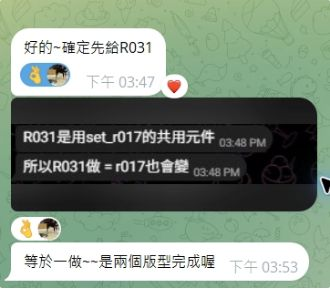
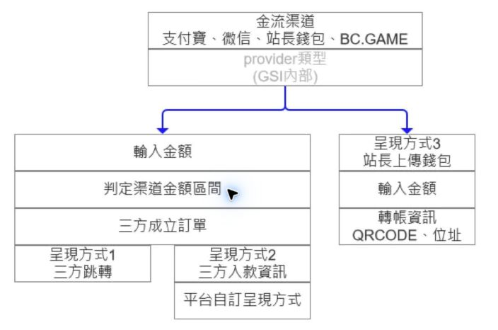
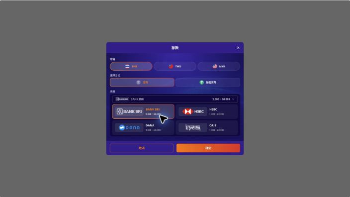
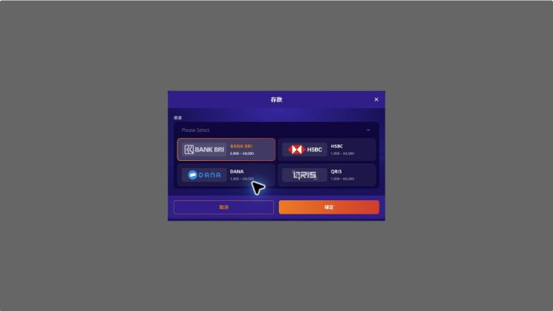
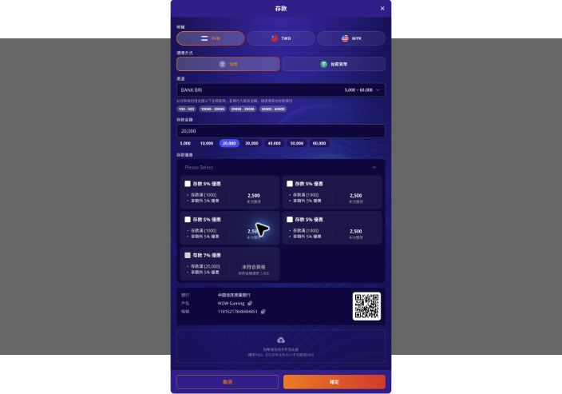

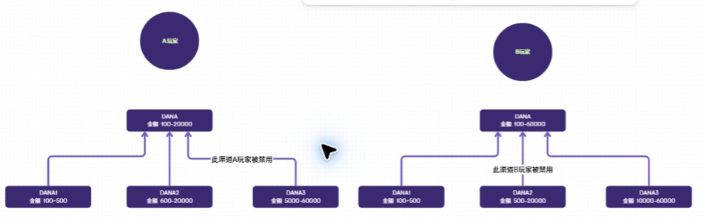

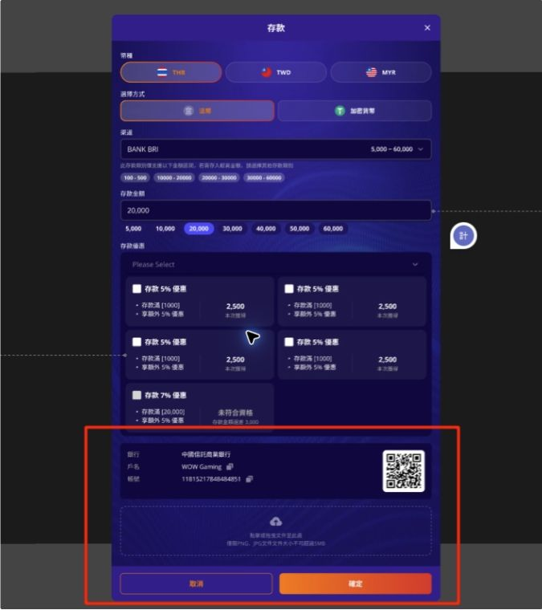
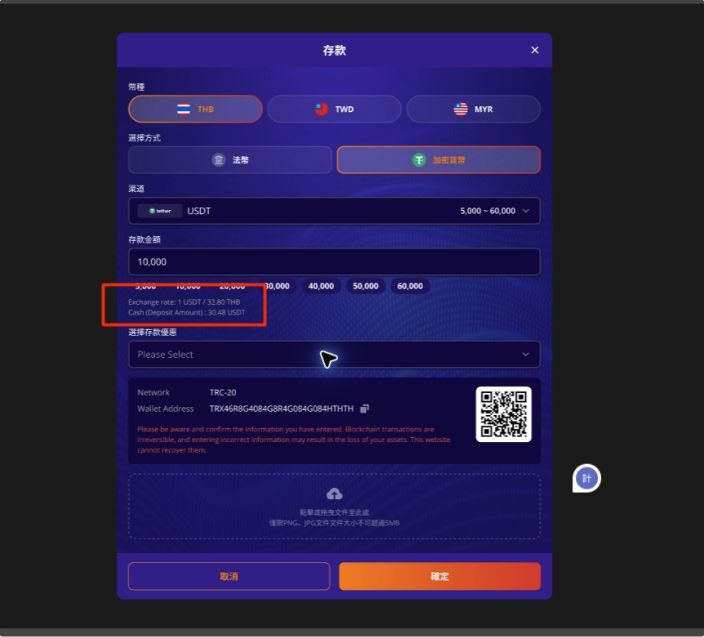
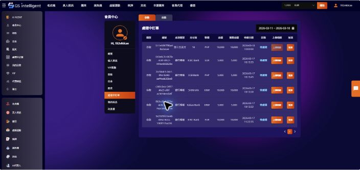

### 後台金流群組 / 金流管理 / 權限參考

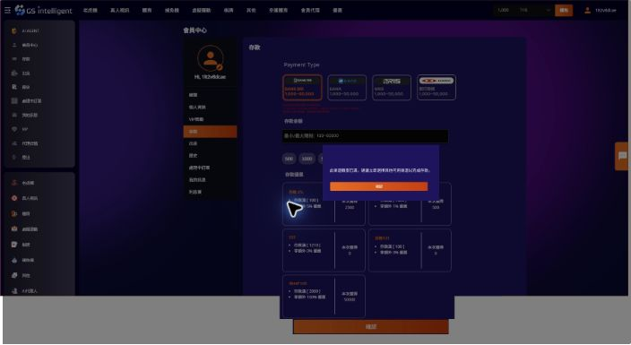

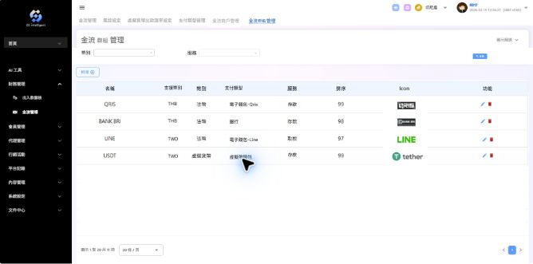
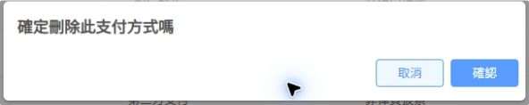
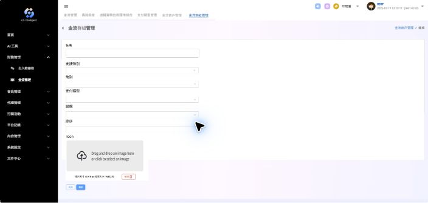

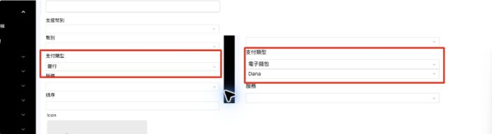

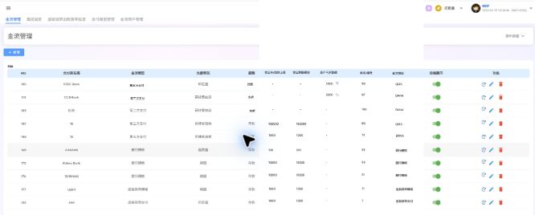
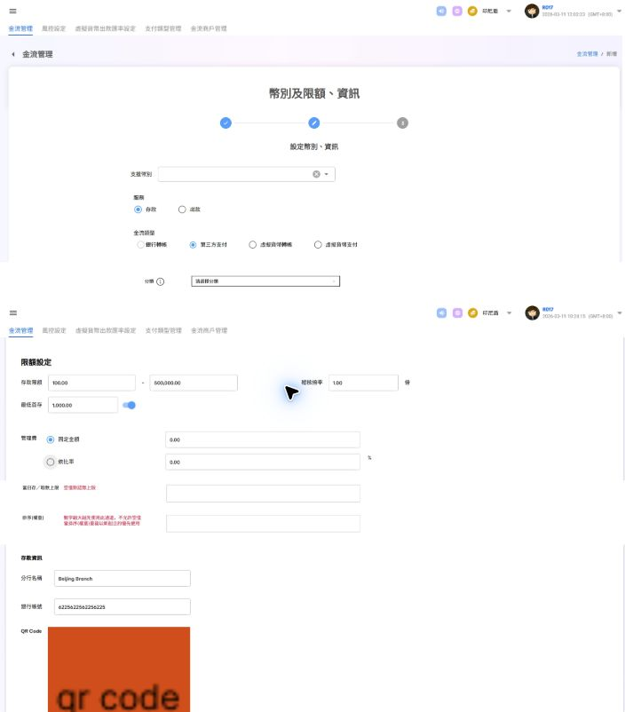
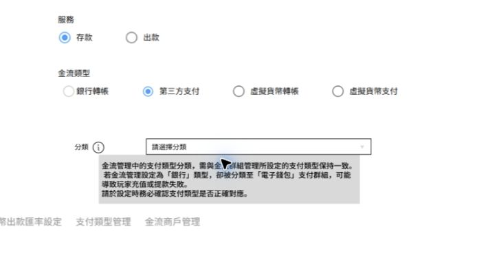
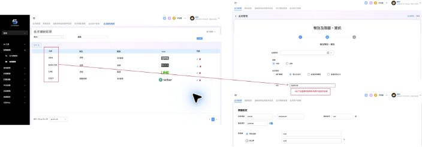
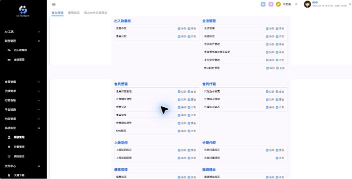
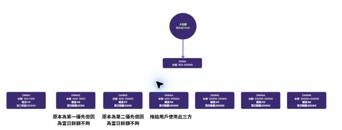
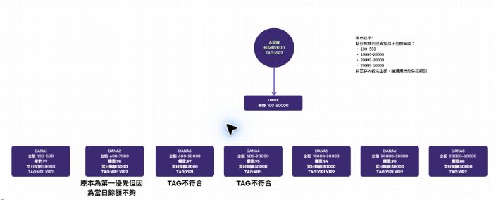

## 不在本次範圍 / 不要動

- 不實作會員端充值 UI；會員端圖片只作為後台資料支援背景。
- 不主動修改非金流相關頁面、表格、篩選、樣式或互動。
- 不新增 local locale JSON；本 repo 使用遠端 i18n。
- 不碰 `src/assets/env/environment.json`。
- 不主動修 ESLint 非阻塞問題。
- 不建立 commit，除非使用者明確要求。

## 驗收標準

### 路由 / 權限

- [ ] 新增「金流群組管理」功能，位於金流/財務管理底下。
- [ ] 新功能 `menuShow` 與現有 `/CashFlow/List/` 金流管理一致：`admin`、`generalAgent`、`agent`、`anibetAgent`。
- [ ] 新功能使用獨立「金流類別管理」權限，不沿用「金流管理」。
- [ ] 權限設定頁在金流管理底下顯示「金流類別管理」，可設定查看/編輯。
- [ ] `支付類型管理` route/menu/入口已移除。

### 金流群組管理

- [ ] 列表可依幣別、服務查詢。
- [ ] 列表顯示名稱、支援幣別、幣別、支付類型、服務、排序、Icon、功能。
- [ ] Search 排序為法幣在前、虛擬幣在後。
- [ ] 新增/編輯表單欄位完整，電子錢包時顯示第二層供應商下拉。
- [ ] Icon 上傳限制符合 40*16px、1MB、jpeg/jpg/png/webp。
- [ ] 名稱重複時顯示需求文案。
- [ ] 刪除前有確認彈窗，確認後才刪除。

### 金流管理列表

- [ ] 列表新增當日存/取款上限、當日剩餘額度、當前可用餘額、排序/權重、金流類別。
- [ ] 無上限與三方不提供餘額 API 時顯示 `-`。
- [ ] Search 排序依服務與排序/權重，權重由大到小。
- [ ] 可手動刷新當前可用餘額。
- [ ] 可重置當日剩餘額度回初始上限。

### 金流管理編輯

- [ ] 編輯頁新增分類、當日存/取款上限、排序(權重)。
- [ ] 分類下拉取自金流群組管理名稱，且依支援幣種/服務/支付類型過濾。
- [ ] 無分類的渠道不能顯示或派發給會員使用。
- [ ] 當日上限空值默認無上限。
- [ ] 修改上限後，剩餘額度以新上限重置。
- [ ] 權重必填正整數，最大 3 字元；重複不檢查。
- [ ] 支付類型分類警示文案顯示正確。

### API / 後端契約

- [ ] 已新增 `agent/payment/group` CRUD wrappers 與 request/response types。
- [ ] 金流群組列表支援前端所需分頁、幣別類型、服務篩選；若後端不支援，spec 需明確改成前端全量 filter。
- [ ] 金流群組表單送出的欄位與 Apifox 一致：`currency_type / name / currency / payment_method / sort_priority / icon_path`。
- [ ] 金流管理既有 `payment/gateway/list` 回傳新增列表欄位。
- [ ] 金流管理既有 `payment/gateway/:id` 與 edit API 支援分類、當日上限、權重。
- [ ] 後端提供餘額刷新 API。
- [ ] 後端提供當日剩餘額度重置 API。
- [ ] 後端提供新「金流類別管理」權限 code，並移除/停用支付類型管理權限。
- [ ] 後端補齊 `deposit` / `withdraw` 的 `group_id` Apifox 文件，並確認 `payment_gateway_id` 是否仍必填。
- [ ] 後端確認 `GET /v1/player/payment_gateway/groups` 的 `payment_method` 正式傳法是 query 還是 GET body。

## 驗證方式

- 本機啟動代理端後台，確認 `/CashFlow/List/` 仍可正常使用。
- 以具備查看權限帳號確認「金流群組管理」出現在金流/財務管理選單。
- 以僅查看權限帳號確認不可新增、編輯、刪除、刷新、重置。
- 以編輯權限帳號測試新增、編輯、刪除群組與金流管理新增欄位儲存。
- 測試支付類型管理選單與入口不存在。
- 針對 touched files 做 focused validation：`git --no-pager diff --check -- <files>`，必要時執行 focused Prettier/ESLint。
