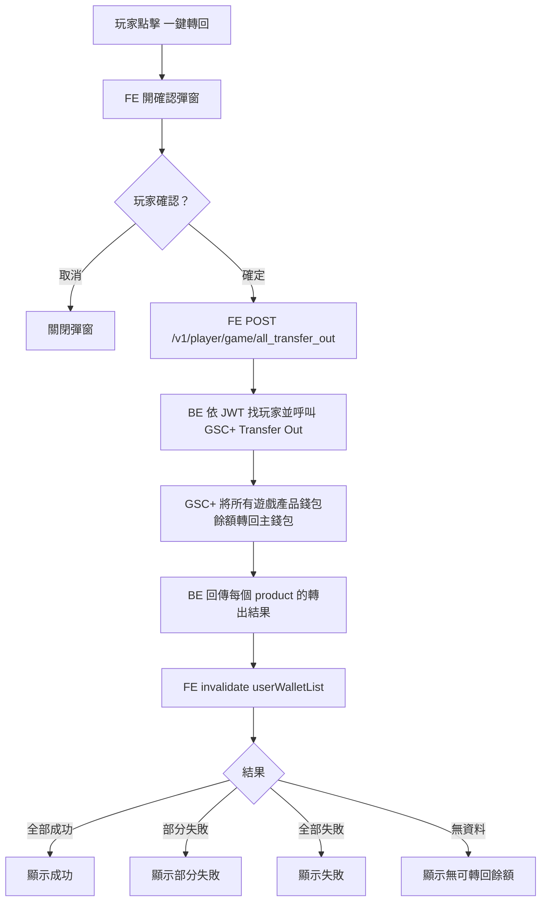

# R017 會員端轉帳錢包一鍵轉出 Spec

> **角色**：會員端把所有遊戲產品的轉帳錢包餘額一次轉出至主錢包。
>
> **API 來源**：Apifox project `4860774`，接口「轉帳錢包一鍵轉出」。
>
> **需求來源**：Notion `[需求 會員端/代理端]玩家可自行將尚未轉出的餘額手動轉出`、`GSC_轉帳錢包串接_API_v1.0.0.docx`。

---

## 1. 核心結論

會員端只需要接自家 BE 提供的 API：

```http
POST /v1/player/game/all_transfer_out
Authorization: Bearer <JWT>
```

Request 不帶 body。身份與可轉出的產品由 JWT / BE 判斷。

這件需求是 **GSC+ 轉帳錢包一鍵轉出**，不是贈金錢包轉出。不得重用 `bonus-transfer`、`BonusTransferDialog`、`WALLET_TYPE_ENUMS.REWARD` 條件邏輯來實作這件事。

---

## 2. 範圍

**做**：

1. 在會員端錢包 dropdown 顯示「一鍵轉回 / 一鍵轉出」入口。
2. 點擊入口後顯示確認彈窗。
3. 玩家確認後呼叫 `POST /v1/player/game/all_transfer_out`。
4. 送出期間顯示 loading 並防止重複點擊。
5. API 完成後刷新會員錢包列表。
6. 依 API 結果顯示成功、部分失敗、全部失敗或無資料的提示。
7. 若目前頁面是歷史紀錄頁，轉出成功後可刷新歷史紀錄 query。
8. 補齊 launch game response 型別中的 `transfer_account` / `transfer_password`，避免轉帳錢包產品登入資訊被型別漏掉。

**不做**：

- 不做代理端 Dashboard 的 `Transfer` button。
- 不做代理端帳變明細頁 mapping。
- 不直打 GSC+ `{{gsc_url}}/api/v1/transfer-wallet/transfer-out`。
- 不在前端產生 GSC+ `sign`。
- 不把這件事併進贈金錢包 `bonus-transfer` 流程。
- 不新增或猜測多語翻譯；缺 key 時先列出並請產品/i18n 補齊。

---

## 3. 參考資料

### 3.1 Apifox

- Project：`https://app.apifox.com/project/4860774`
- 模組：`會員端 / 錢包`
- 接口名稱：`轉帳錢包一鍵轉出`
- Method：`POST`
- Path：`/v1/player/game/all_transfer_out`
- 狀態：`开发中`
- 說明：`會員將所有遊戲產品錢包餘額一次轉出至主錢包。`

### 3.2 Notion

- URL：`https://app.notion.com/p/wowgaming/34cfc5d788a9809f9cbdfb75b8018c3b`
- 會員端關聯圖：錢包 dropdown 右上有「Cash 一鍵轉回」入口。
- 代理端圖片與流程只作背景參考，本 spec 不實作代理端。

### 3.3 GSC+ docx 背景

檔案：`/Users/kenyu/Downloads/GSC_轉帳錢包串接_API_v1.0.0.docx`

背景流程：

- `TRANSFER_IN`：玩家登入廠商 App 後，GSC+ 呼叫我方 withdraw callback，把玩家主錢包資金轉入供應商錢包。
- `TRANSFER_OUT`：玩家或後台觸發轉出後，GSC+ 呼叫我方 deposit callback，把供應商錢包資金轉回主錢包。

這些 callback / GSC+ operator API 都是 BE 責任，會員端前端只接 Apifox 的 `all_transfer_out`。

---

## 4. 現有 NX 可重用基礎

目前 repo 已有：

- API base：`apps/r017/.env` / `.env.local`
  - `NUXT_PUBLIC_API_BASE=https://api-devm-dev.gsiwl.com`
- game endpoint 區塊：
  - `libs/shared/ui-layer/src/lib/api/endpointPaths/index.ts`
- request wrapper：
  - `libs/shared/ui-layer/src/lib/api/axiosInterceptors.ts`
  - `requestFn` 會自動帶 `Authorization: Bearer <access_token>`
- auth token：
  - `libs/shared/ui-layer/src/lib/composables/useAuth.ts`
  - `libs/shared/ui-layer/src/lib/stores/auth.ts`
- wallet list：
  - `GET /v1/player/center/wallets`
  - `libs/shared/ui-layer/src/lib/api/apiFunctions/userInfo_getUserWalletList.ts`
- wallet query key：
  - `TANSTACK_QUERY_KEY_USER_WALLET_LIST`
- history list：
  - `GET /v1/player/center/money/history`
  - `libs/shared/ui-layer/src/lib/api/apiFunctions/report_getMoneyHistoryList.ts`
- launch game：
  - `POST /v1/player/game/launch_game`
  - `libs/shared/ui-layer/src/lib/api/apiFunctions/game_launchGame.ts`

---

## 5. API Contract

### 5.1 All Transfer Out

新增 endpoint：

```ts
ENDPOINT_PATHS.GAME.ALL_TRANSFER_OUT =
  `/${BASE_ENDPOINT_VERSION.V1}/player/game/all_transfer_out`
```

API function：

```ts
export interface AllTransferOutItem {
  product_code?: number
  code?: number
  message?: string
}

export type AllTransferOutResponse = AllTransferOutItem[]

export const postAllTransferOut = () => {
  return requestFn<null, AllTransferOutResponse>(
    ENDPOINT_PATHS.GAME.ALL_TRANSFER_OUT,
    null,
    {
      name: "postAllTransferOut",
      method: "post"
    }
  )
}
```

Request：

```http
POST /v1/player/game/all_transfer_out
Authorization: Bearer <JWT>
```

Request body：無。

Apifox 200 response：

```json
{
  "code": 0,
  "msg": "success",
  "data": [
    {
      "product_code": 1001,
      "code": 0,
      "message": "success"
    }
  ]
}
```

前端判斷規則：

- `response.status === true` 且 `response.code === SUCCESS`：API request 成功。
- `response.data` 是陣列時，逐筆檢查產品結果。
- item `code === 0` 視為該產品轉出成功。
- item `code !== 0` 視為該產品轉出失敗，顯示 `message` 或 fallback 錯誤文案。
- `data` 為空陣列或不存在時，視為「沒有產品需要轉出」或「沒有可轉出餘額」，文案需產品確認。

### 5.2 Launch Game Response 補型別

`LaunchGameResponse` 應補：

```ts
export interface LaunchGameResponse {
  game_content: string
  game_url: string
  currencies: string[]
  transfer_account?: string
  transfer_password?: string
}
```

本 spec 不要求顯示帳密 UI，只要求型別不漏欄位。帳密顯示/copy UX 屬於「GSI 轉帳錢包前台登入優化」範圍。

---

## 6. UI Flow

### 6.1 入口

位置：會員端 header 錢包 dropdown。

流程：

```text
玩家開啟錢包 dropdown
  -> 顯示「一鍵轉回」button
  -> 玩家點擊
  -> 開確認彈窗
```

入口顯示條件：

- 第一版可在已登入且錢包 dropdown 有資料時顯示。
- 若 BE 後續提供 capability，例如 `transfer_wallet_enabled`，則應改為依 capability 顯示。
- 不以 `WALLET_TYPE_ENUMS.REWARD` 判斷，因為這不是贈金錢包功能。

### 6.2 確認彈窗

流程：

```text
點「一鍵轉回」
  -> 彈出確認彈窗
  -> 取消：關閉，不呼叫 API
  -> 確定：呼叫 postAllTransferOut()
```

文案需確認，不可硬寫未確認翻譯。

目前來源有兩版：

- 圖上：`確認撥出所有餘額至一般錢包`
- Notion 表格：`確認轉回所有餘額至現金錢包`

本 spec 建議使用較貼近會員端術語的「現金錢包」，但實作前需產品確認最終文案。

### 6.3 Submit 行為

流程：

```text
玩家按確定
  -> button loading
  -> 禁止重複送出
  -> POST /v1/player/game/all_transfer_out
  -> invalidate wallet list query
  -> 根據產品結果顯示提示
  -> 關閉或保留彈窗
```

結果處理：

| 情境 | 條件 | UI |
|---|---|---|
| 全部成功 | `data` 內每筆 `code === 0` | success toast |
| 部分成功 | 有成功也有失敗 | warning toast，列出失敗產品數或 message |
| 全部失敗 | `data` 內每筆 `code !== 0` | error toast |
| 無資料 | `data` 空或 null，但 response 成功 | info toast，文案待確認 |
| request 失敗 | `response.status === false` | error toast，顯示 `msg` 或 code |
| 未登入/JWT 失效 | 401 / `901003 Invalid JWT token` | 走既有 auth error flow |

---

## 7. Data Flow



---

## 8. 建議檔案

實作時依既有 pattern 微調，但責任邊界保持如下。

```txt
libs/shared/ui-layer/src/lib/api/endpointPaths/index.ts
  - GAME.ALL_TRANSFER_OUT

libs/shared/ui-layer/src/lib/api/apiFunctions/game_postAllTransferOut.ts
  - postAllTransferOut()
  - AllTransferOutItem / AllTransferOutResponse

libs/shared/ui-layer/src/lib/composables/useTransferWalletAllTransferOut.ts
  - open confirm dialog state
  - submitAllTransferOut()
  - result summary
  - wallet list invalidation

libs/shared/ui-layer/src/lib/components/dialogs/TransferWalletAllTransferOutDialog.vue
  - confirmation dialog
  - loading state
  - cancel / confirm buttons

libs/shared/ui-layer/src/lib/components/header/CurrencyInfo.vue
  - wire dropdown button to open confirm dialog

apps/r017/src/layouts/default.vue
  - mount <TransferWalletAllTransferOutDialog />

libs/shared/ui-layer/src/lib/api/commonTypes/gameTypes.ts
  - add transfer_account / transfer_password to LaunchGameResponse
```

若目前 header dropdown 正在重構成 `WalletDropdownPanel.vue`，一鍵轉回入口放在 dropdown panel 頂部；若尚未重構，先在現有 `CurrencyInfo.vue` 補入口，避免大範圍改動。

---

## 9. i18n

不得直接硬寫多語文案。需要確認或新增以下 key：

| 建議 key | 用途 | zh-TW 建議文案 |
|---|---|---|
| `transferWallet.allTransferOut` | button | 一鍵轉回 |
| `transferWallet.confirmAllTransferOut` | confirm message | 確認轉回所有餘額至現金錢包 |
| `transferWallet.transferSuccess` | success toast | 轉回成功 |
| `transferWallet.transferPartialFailed` | warning toast | 部分遊戲錢包轉回失敗 |
| `transferWallet.transferFailed` | error toast | 轉回失敗 |
| `transferWallet.noTransferableBalance` | info toast | 目前沒有可轉回餘額 |

若產品確認用「一般錢包」而不是「現金錢包」，需同步調整 key 對應翻譯。

---

## 10. Error Handling

### 10.1 API request failure

使用現有 `requestFn` / `handleApiError` 行為。

若回：

```json
{
  "code": 901003,
  "msg": "Invalid JWT token"
}
```

視為登入狀態失效，走既有 auth error flow。

### 10.2 Product-level failure

即使 top-level `code === 0`，仍需檢查 `data[]`：

```json
{
  "code": 0,
  "msg": "success",
  "data": [
    {
      "product_code": 1323,
      "code": 0,
      "message": "success"
    },
    {
      "product_code": 1001,
      "code": 2000,
      "message": "product maintenance"
    }
  ]
}
```

上例 UI 應為部分失敗，而不是完全成功。

### 10.3 Empty result

Apifox 未明確定義空陣列語意。實作假設：

- `code === 0` 且 `data` 空：沒有可轉出的遊戲產品餘額。

此文案與行為需產品/BE 確認。

---

## 11. Testing / Verification

不要執行 `tsc --noEmit`。

建議驗證：

1. API wrapper 單元測試或最小 mock 測試：
   - method 是 `post`
   - path 是 `/v1/player/game/all_transfer_out`
   - request body 是 `null`
2. composable result summary 測試：
   - 全部成功
   - 部分失敗
   - 全部失敗
   - 空 data
3. UI smoke：
   - 點一鍵轉回開彈窗
   - 取消不呼叫 API
   - 確定後 loading 防連點
   - 成功後 invalidate wallet list
4. 瀏覽器手測：
   - 帶有效 JWT 打 DEV API 成功
   - JWT 失效時走既有登入失效處理

依專案規則：可以寫測試驗證，但不要把臨時 test files 放進 commit，除非使用者明確同意。

---

## 12. Acceptance Criteria

- [ ] 會員端新增 `POST /v1/player/game/all_transfer_out` API wrapper。
- [ ] Request 只靠 JWT header，不送 body。
- [ ] Header dropdown 有一鍵轉回入口。
- [ ] 點入口會先開確認彈窗，不會直接送出。
- [ ] 取消彈窗不呼叫 API。
- [ ] 確定後送出 API，期間 loading 並防止重複點擊。
- [ ] 成功後刷新 `GET /v1/player/center/wallets` 對應 query。
- [ ] top-level success 後仍會檢查 `data[]` 每個 product 的 `code`。
- [ ] 全部成功、部分失敗、全部失敗、空 data 都有明確 UI 處理。
- [ ] JWT 失效使用既有 auth error flow。
- [ ] `LaunchGameResponse` 補上 `transfer_account` / `transfer_password` optional 欄位。
- [ ] 沒有使用 `bonus-transfer` API 或贈金錢包條件邏輯。
- [ ] 沒有新增未確認的硬編碼多語文案。
- [ ] 不包含代理端 Dashboard 實作。

---

## 13. 實作前需確認

1. 確認 button 文案用「一鍵轉回」還是「一鍵轉出」。
2. 確認確認彈窗文案用「現金錢包」還是「一般錢包」。
3. 確認 `data: []` 是否代表沒有可轉出餘額。
4. 確認 product-level `code !== 0` 的錯誤碼是否需要前端做 i18n mapping，或直接顯示 `message`。
5. 確認是否需要 capability 控制入口顯示；若 BE 沒提供，第一版採「登入且 wallet dropdown 可用就顯示」。
